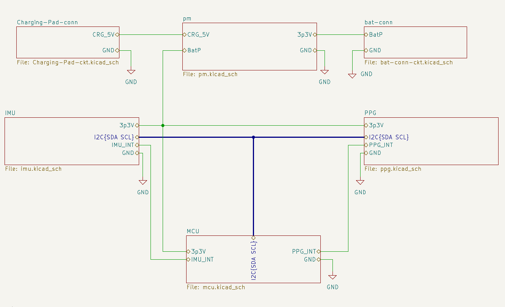
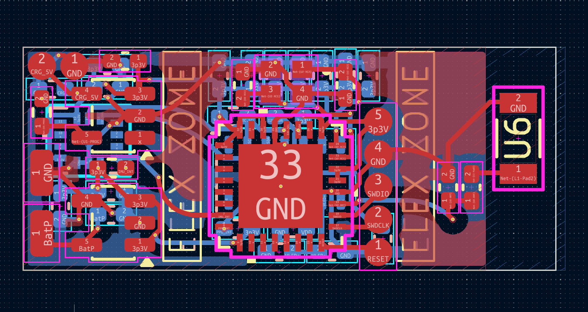

# Compact BLE-Based Smart Ring PCB for Health Monitoring and Gesture Detection

## Overview

This repository contains the complete KiCad project files, PCB layouts, schematic designs, manufacturing outputs, and documentation for a compact BLE-enabled Smart Ring developed for health monitoring and gesture detection applications.

The project focuses on wearable-oriented PCB miniaturization, low-power BLE communication, physiological sensing, gesture detection, RF-aware PCB implementation, and compact embedded system integration within a smart-ring-compatible form factor.

The implemented smart ring integrates:

- Nordic nRF52810 BLE SoC
- MAX30102 PPG Sensor
- ICM-42670 IMU Sensor
- Li-ion Charging Subsystem
- 3.3V Power Regulation
- Compact BLE Antenna Implementation

The final PCB dimensions achieved are:

22.8 mm × 9.6 mm

---

# Project Features

- Bluetooth Low Energy (BLE) Communication
- Heart Rate Monitoring
- SpO2 Monitoring
- Gesture Detection
- Motion Tracking
- Rechargeable Li-ion Battery Support
- Compact Wearable PCB Architecture
- RF Antenna Keepout Implementation
- Compact SWD Debugging Pads
- Exposed Charging Pads
- Backside PPG Sensor Placement
- 0402 Passive Component Integration

---

# Hardware Components

| Component | Manufacturer | Part Number |
|---|---|---|
| BLE MCU | Nordic Semiconductor | nRF52810-QCAA-T |
| PPG Sensor | Analog Devices | MAX30102 |
| IMU Sensor | TDK InvenSense | ICM-42670-P |
| Battery Charging IC | Microchip Technology | MCP73831-2-OT |
| 3.3V LDO | Texas Instruments | TPS78233DDC |
| 32 MHz Crystal | ECS Inc. | ECS-320-8-37-CKM-TR |
| 2.4 GHz Antenna | Johanson Technology | 2450AT18A100E |

---

# PCB Miniaturization and Design Evolution

The initial smart ring implementation utilized a larger PSoC BLE module-based architecture which occupied approximately:

30.4 mm × 12.0 mm

Although the module simplified BLE integration, it significantly increased PCB area and routing constraints.

To improve compactness and wearable compatibility, the architecture was migrated to the Nordic nRF52810 BLE SoC in a compact QFN package.

After multiple PCB iterations and routing optimizations, the final PCB dimensions were successfully reduced to:

22.8 mm × 9.6 mm

Major optimizations implemented include:

- Migration from BLE module to compact QFN SoC
- Compact exposed SWD pads
- Exposed charging pads
- Compact battery solder pads
- 0402 passive components
- Backside PPG placement
- RF antenna keepout implementation
- Routing optimization
- Compact subsystem placement
- Improved RF-aware PCB design

---

# PCB Design Highlights

## BLE Processing Subsystem

- Nordic nRF52810 BLE SoC
- ARM Cortex-M4
- BLE communication support
- Low-power wearable operation
- Compact QFN package

## Physiological Sensing

- MAX30102 optical PPG sensor
- Heart-rate monitoring
- SpO2 monitoring
- Backside wearable placement

## Motion Sensing

- ICM-42670 6-axis IMU
- Gesture detection
- Motion tracking
- Activity monitoring

## Power Management

- MCP73831 Li-ion charging IC
- TPS78233 low-noise LDO
- Rechargeable Li-ion battery support

## RF Subsystem

- 2.4 GHz chip antenna
- RF matching network
- Dedicated antenna keepout region

---

# Industrial-Level Miniaturization Considerations

Commercial smart-ring products generally utilize advanced packaging and PCB technologies including:

- WLCSP (Wafer-Level Chip Scale Packaging)
- HDI PCB technology
- Blind and buried vias
- Microvia routing
- Flexible PCB structures
- System-in-Package (SiP) integration
- Ultra-miniature PMIC solutions

Industrial wearable PMIC solutions analyzed during this project include:

- TI BQ25120A
- Nordic nPM1300
- Dialog DA9070
- MAX20345

These PMICs integrate:

- Battery charging
- Multiple LDOs
- Buck/boost converters
- Battery protection
- Fuel gauging

within a single compact package.

Although such PMICs can significantly reduce PCB area, they introduce substantially higher routing complexity and manufacturing difficulty. Therefore, a simpler discrete charging and regulation architecture was selected for the current implementation.

---

# Repository Structure

smart-ring-project/

├── README.md

├── LICENSE

├── smart_ring.kicad_pro

├── smart_ring.kicad_sch

├── smart_ring.kicad_pcb

├── Gerbers/

├── Images/

├── Report/

└── Datasheets/

---

# PCB Images

## Root Schematic

## PCB Layout and Routing

## 3D PCB Top View

(Add image here)

## 3D PCB Bottom View

(Add image here)

---

# Software Used

- KiCad 8.0
- GitHub
- Overleaf
- IEEE Conference LaTeX Template

---

# Verification and Validation

The implemented smart ring PCB successfully passed:

- Electrical Rule Check (ERC)
- Design Rule Check (DRC)
- Footprint Verification
- Connectivity Validation

The design additionally incorporates:

- RF-aware antenna keepout implementation
- Ground-plane optimization
- Compact routing methodology
- Wearable-oriented subsystem placement

---

# Future Improvements

Future improvements may include:

- Firmware implementation
- Gesture-recognition algorithms
- Mobile application development
- Flexible PCB implementation
- HDI PCB technology
- WLCSP packaging
- Advanced PMIC integration
- Battery-life optimization

---

# License

This project is licensed under the MIT License.

See the LICENSE file for details.

---

# Author

Vipin Kumar Mishra  
M.Tech ECE (VLSI)  
IIIT Bangalore

---

# Acknowledgement

This project was developed as part of the Electronic Systems Packaging course project focusing on compact wearable embedded system design, PCB miniaturization, RF-aware layout implementation, and smart wearable hardware development.

